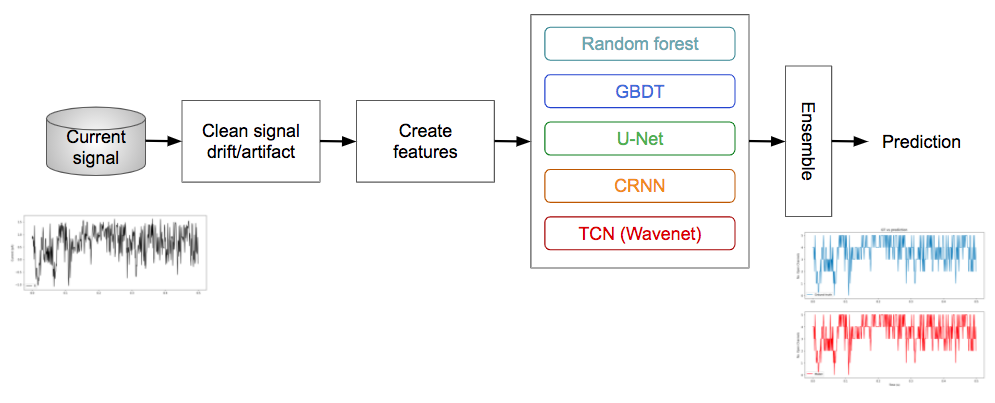

# Kaggle - ion channels identification
This is the Bronze medal (224th/2618 place) solution to the competition [Kaggle ion channels identification](https://www.kaggle.com/c/liverpool-ion-switching).

## Overview
The task is to build a model to predict the number of open ion channels given the measured current signal (time series).

### Remove artifacts and reduce noise from data
The data is semi-synthetic, firstly created from Markov models then input to patch clamp, as described in the [paper](https://www.nature.com/articles/s42003-019-0729-3). And the artifacts (called drift by the author) and the noise from patch clamp amplifier a lot influence the final model performance. The artifacts can be removed from fitting a cosine function on the biased part of the signal, while the AC noise can be reduced by the notch filter.

### Features
Many features are created and tried including rolling stats (mean, std, quantile, min/max), shifted features (shifting the signal with steps), and those from signal processed (low/high pass filtered, gradients). Finally the shifted ones and signal amplitudes work best.

### Model
With correct feature engineering, the models from random forest or GBDT work pretty well. The hyperparamters can be optimized from Bayesian optimizations. When it comes to neural networks, convolution then recurrent network (CRNN) gives a decent result. But finally dilated causal convolution network (TCN or Wavenet) best describes the Markovian signal.

### Dependencies
hyperopt 0.2.5
rapids 0.15.0
xgboost 1.2.1
tensorflow 2.2.0
